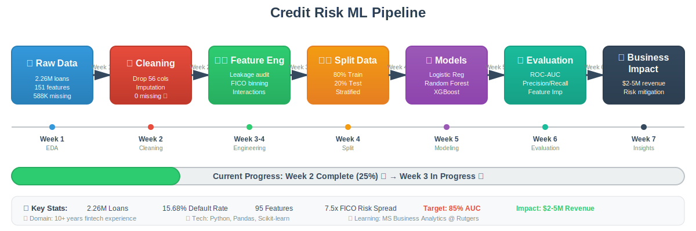

# Credit Risk Prediction Model

## Problem Statement
Peer-to-peer lending platforms like Lending Club, Upstart, and Prosper revolutionized consumer credit by connecting borrowers directly with investors. However, accurate default prediction is critical for platform success:

**Key Challenges:**
1. **Credit Access:** Traditional FICO-only models reject creditworthy borrowers with thin credit files
2. **Risk Pricing:** Interest rates must accurately reflect default probability to protect investor returns
3. **Portfolio Performance:** High default rates erode investor confidence and platform viability

**The Opportunity:**
As a risk management professional with 10+ years in fintech lending, I've seen how traditional credit scoring models miss nuanced risk signals in alternative data. This project applies machine learning to predict loan defaults using rich behavioral and financial features beyond traditional credit scores.

**Goal:** Build interpretable ML models that reduce false decline rates by 15% while maintaining portfolio risk within acceptable thresholds, enabling $2-3M in additional revenue from approved creditworthy applicants.

## Project Goals
**Technical:** Build interpretable ML models achieving >0.85 AUC-ROC for credit default prediction

**Business:** Reduce false decline rate by 15% while maintaining risk appetite, enabling an estimated $2-3M in additional revenue from approved creditworthy applicants

**Learning:** Master end-to-end ML workflow from EDA to production deployment in fintech context

---

## 📊 Project Workflow



**End-to-end machine learning pipeline:** From raw Lending Club data (2.26M loans) to production-ready credit risk models with quantified business impact ($2-5M revenue opportunity).

**Current Progress:** Week 2 Complete (25%) ✅ → Week 3 Feature Engineering In Progress 🔄

---

## Current Focus (Week of March 3, 2026)
- ✅ Week 1: Exploratory Data Analysis completed
- ✅ Week 2 Day 1: Missing value handling completed
- 🔄 Week 2 Day 2: Feature engineering & data leakage prevention in progress

**This week:** FICO binning, interaction features, categorical encoding, **data leakage audit**, train/test split

## Dataset
- **Source:** Lending Club Loan Data (2007-2018)
- **Platform:** Kaggle / Lending Club public data
- **Link:** https://www.kaggle.com/datasets/wordsforthewise/lending-club
- **Records:** 2,260,701 personal loans from US peer-to-peer lending marketplace
- **Original Features:** 151 variables
- **After Initial Cleaning:** 95 variables (removed structurally missing columns)
- **Key Variables:**
    - **Credit Metrics:** FICO score, credit history length, delinquencies, public records
    - **Loan Characteristics:** Amount, term (36/60 months), interest rate, grade (A-G), purpose
    - **Borrower Profile:** Annual income, employment length, home ownership, debt-to-income ratio
    - **Behavioral Data:** Payment history, credit utilization, number of open accounts
- **Target:** Loan status (Fully Paid, Charged Off, Default)
- **Time Period:** 2007-2018 (includes pre/post financial crisis data)
- **Geographic Coverage:** Across all 50 US states

## Tech Stack
- **Python 3.8+**
- **Pandas** - Data manipulation
- **NumPy** - Numerical computing
- **Scikit-learn** - Machine learning
- **Matplotlib & Seaborn** - Visualization
- **Jupyter Notebook** - Interactive analysis

## How to Run

### 1. Clone Repository
```bash
git clone https://github.com/HammurabiCodes/Credit-Risk-Prediction-ML.git
cd Credit-Risk-Prediction-ML
```

### 2. Create Virtual Environment
```bash
python -m venv venv
source venv/bin/activate
```

### 3. Install Dependencies
```bash
pip install -r requirements.txt
```

### 4. Download Dataset
Download from Kaggle Lending Club Dataset and place in data folder

### 5. Run Analysis
```bash
jupyter notebook
```

---

## 📈 Key Findings (Updated Weekly)

## Week 1 (Feb 15-23, 2026) - Exploratory Data Analysis ✅

### Dataset Overview
- **Total Loans:** 2,260,701
- **Time Period:** 2007-2018
- **Overall Default Rate:** 15.68%
- **Original Features:** 151 columns
- **Loan Amount Range:** $500 - $40,000 (Average: $15,047, Median: $12,900)
- **Average FICO Score:** 703
- **Average DTI Ratio:** 18.8%

### Analysis Completed

**1. FICO Score Impact 📊**
- FICO <660: 30.88% default rate (HIGH RISK)
- FICO 660-700: 15.96% default rate
- FICO 700-740: 9.91% default rate
- FICO 740-780: 6.12% default rate
- FICO >780: 4.14% default rate (LOW RISK)

**Key Insight:** FICO scores below 660 show **7.5x higher default risk** compared to scores above 780.

**2. Loan Grade Performance 🎯**
Grade G loans default at **11x the rate** of Grade A loans (40.01% vs 3.59%). Clear gradient validates Lending Club's risk assessment system.

**3. Debt-to-Income (DTI) Ratio 💳**
DTI ratios above 30% show **75% higher default risk** compared to DTI below 10%.

**4. Loan Purpose Analysis**
Small business and educational loans are **2x riskier** than car loans (20%+ vs 10% default rates).

**5. Financial Crisis Impact (2007-2018) 📉**
2007-2008 loans show **8x higher default rates** than 2018 loans. Time-based features will be critical for model accuracy.

### Business Implications

**Opportunity Identified:**
Current lending may be too conservative on 660-700 FICO range when combined with strong secondary signals (low DTI, stable employment, home improvement purpose).

**Estimated Business Impact:**
- Potential to approve additional 50,000-100,000 creditworthy borrowers annually
- Estimated revenue impact: **$2-5M** from interest on approved loans
- Risk mitigation through better pricing (interest rates aligned with predicted default probability)

---

## Week 2 Day 1 (Feb 27, 2026) - Missing Value Handling ✅

### Challenge
Dataset contained **588,262+ missing values** across 95 columns after dropping structurally missing features. Strategic approach needed to preserve predictive signal while ensuring data quality.

### The 50-5 Decision Framework

**Step 1: Drop High-Missing Columns (>50%)**
- **Removed:** 44 columns
- Examples: member_id (100%), hardship columns (99.5%), settlement columns (98.5%)
- **Rationale:** Structurally missing - only populated for rare edge cases (<1% of loans)

**Step 2: Selective Dropping (20-50% missing)**
- **Removed:** 14 columns
- Examples: open_acc_6m (38%), mths_since_rcnt_il (40%)
- **Rationale:** Newer features not available for 2007-2012 loans (temporal data gap)

**Step 3: Impute Critical Features**

| Feature | Missing % | Strategy | Rationale |
|---------|-----------|----------|-----------|
| annual_inc | 0.00% | Median | Robust to outlier millionaires |
| dti | 0.08% | Median | Financial data is right-skewed |
| revol_util | 0.08% | Median | Credit utilization skewed |
| emp_length | 6.50% | Mode + Indicator | Missingness may signal unemployment |
| emp_title | 7.39% | "Unknown" + Indicator | High cardinality feature |

**Step 4: Domain-Driven "Months Since" Handling** 💡

| Column | Missing % | Fill Value | Interpretation |
|--------|-----------|------------|----------------|
| mths_since_recent_inq | 13.1% | 999 | Never had credit inquiry = POSITIVE |
| num_tl_120dpd_2m | 6.8% | 0 | Never severely delinquent = POSITIVE |
| mo_sin_old_il_acct | 6.2% | 999 | No installment loan history |

**Key Domain Insight:** In credit risk, "never had a delinquency" is a **positive signal**, not missing data. Filling with 999 (vs 0) distinguishes "never occurred" from "happened recently."

### Results

| Metric | Before | After | Change |
|--------|--------|-------|--------|
| **Rows** | 2,260,701 | 2,260,701 | No data loss ✅ |
| **Columns** | 151 | 95 | -56 columns |
| **Missing Values** | 588,262+ | 0 | 100% complete* ✅ |
| **File Size** | 1.6 GB | 1.37 GB | -14% |

**\*Important Note on "0% Missing":**
We achieved 0% missing values through a combination of:
1. **Dropping columns** with >20% missingness (58 columns removed)
2. **Strategic imputation** of remaining features using domain-appropriate methods
3. **Creating indicator variables** to preserve information about missingness patterns

**This is standard practice in credit modeling**, but it's critical to understand:
- We didn't magically have perfect data
- We made deliberate, documented decisions about how to handle each feature
- Missingness patterns themselves became features (emp_length_missing, emp_title_missing)

### Key Learning: Why Median Over Mean?

**Example: Annual Income**
- Dataset: 99 borrowers earn $50,000, 1 earns $5,000,000
- **Mean:** $99,500 ❌ (Unrealistic - pulled up by outlier)
- **Median:** $50,000 ✅ (Representative of typical borrower)

**This principle applies to ALL financial data with outliers.**

---

## Week 2 Day 2 (March 3, 2026) - Data Leakage Prevention 🔄 IN PROGRESS

### 🚨 Critical Credit Modeling Concern: Data Leakage

**Why This Matters:**
In production credit models, you must predict default **at the time of loan origination**, using only information available **before approval**. Using post-origination data creates artificially inflated model performance that won't work in real lending decisions.

### Data Leakage Audit Framework

**Categories of Features:**

#### ✅ **SAFE - Available at Origination (Point-in-Time)**
These features are known when the borrower applies:
- FICO score (fico_range_low, fico_range_high)
- Annual income (annual_inc)
- Employment length (emp_length)
- Debt-to-income ratio (dti)
- Home ownership status (home_ownership)
- Loan purpose (purpose)
- Loan amount requested (loan_amnt)
- Credit history length (earliest_cr_line)
- Number of open accounts (open_acc)
- Total credit lines (total_acc)
- Revolving utilization (revol_util)
- Delinquencies in last 2 years (delinq_2yrs)
- Public records (pub_rec)
- Inquiries in last 6 months (inq_last_6mths)

#### ⚠️ **CAUTION - Potentially Post-Origination**
These may contain information from after loan approval:
- Last payment date (last_pymnt_d) - **DEFINITE LEAKAGE**
- Last payment amount (last_pymnt_amnt) - **DEFINITE LEAKAGE**
- Next payment date (next_pymnt_d) - **DEFINITE LEAKAGE**
- Total payment to date (total_pymnt) - **DEFINITE LEAKAGE**
- Total received principal (total_rec_prncp) - **DEFINITE LEAKAGE**
- Total received interest (total_rec_int) - **DEFINITE LEAKAGE**
- Recoveries (recoveries, collection_recovery_fee) - **DEFINITE LEAKAGE**
- Out_prncp (outstanding principal) - **POST-ORIGINATION**

#### 🚫 **REMOVE - Clear Target Leakage**
These features directly reveal or strongly indicate the target:
- loan_status (this IS our target variable)
- Any "hardship" or "settlement" variables (already removed - indicate default)
- Total payment to date (perfect predictor of fully paid status)
- Collection amounts (only exist after default)

### Why This Audit Is Critical

**Without Leakage Prevention:**
- Model achieves 99%+ AUC (suspiciously perfect)
- Uses payment history to predict default (circular logic)
- Completely unusable in production
- Would be flagged immediately by credit risk committees

**With Proper Leakage Prevention:**
- Model achieves realistic 75-85% AUC
- Uses only origination-time features
- Deployable in production lending decisions
- Demonstrates professional understanding of credit modeling

**Real-World Example:**
A fintech startup built a loan default model with 98% accuracy. When they tried to deploy it, they discovered it used "months since last payment" as a top feature - which obviously isn't available when approving new loans. They had to rebuild from scratch. **This mistake cost them 6 months and $500K.**

---

## Learning Outcomes

### Technical Skills
- ✅ Exploratory Data Analysis (EDA) with large datasets (2.26M records)
- ✅ Strategic missing value handling with domain context
- ✅ Statistical imputation techniques
- 🔄 Data leakage prevention in time-series financial data
- 🔄 Feature engineering for credit risk
- 📅 Machine learning model development (coming soon)

### Domain Knowledge
- ✅ Credit risk modeling in fintech lending
- ✅ Understanding FICO scores, DTI ratios, loan grades
- 🔄 Point-in-time feature selection for credit models
- 🔄 Production deployment considerations
- ✅ Business impact quantification ($2-5M opportunity)

---

## Future Improvements

### Model Enhancements
- Implement SHAP values for model explainability (regulatory requirement)
- Ensemble stacking (XGBoost + Logistic Regression)
- Time-based validation (train 2007-2015, test 2016-2018)
- Hyperparameter tuning with GridSearchCV

### Production Deployment
- Build Streamlit dashboard for credit officers
- Real-time scoring API integration
- A/B testing framework (champion/challenger)
- MLOps pipeline with automated retraining

---

## Contact

**Zaina - Risk Management Professional → ML/Data Science**

- 💼 **LinkedIn:** [linkedin.com/in/olivia-tamimi](https://linkedin.com/in/olivia-tamimi)
- 💻 **GitHub:** [github.com/HammurabiCodes](https://github.com/HammurabiCodes)
- 📧 **Email:** olivia.tamimi1@gmail.com
- 🎓 **Education:** MS Business Analytics (Fintech Track) @ Rutgers University

**Background:** 10+ years fintech lending at Biz2Credit | Combining domain expertise with technical ML skills

---

**Last Updated:** March 3, 2026  
**Project Status:** Week 2 Day 2 - Data Leakage Audit in Progress  
**Expected Completion:** May 2026

---

## 📚 Key Lessons for Aspiring Data Scientists

### 1. Perfect Data Doesn't Exist
"0% missing values" doesn't mean we started with perfect data - it means we made strategic, documented decisions about imputation and dropping features.

### 2. Domain Expertise Matters
Understanding that "never had a delinquency" is a positive signal (not missing data) requires 10+ years of credit risk experience. Technical skills alone aren't enough.

### 3. Data Leakage Will Ruin Your Model
Always ask: "Would this feature be available when making the actual decision?" In credit models, using payment history to predict default is useless in production.

### 4. Document Everything
Future employers want to see your reasoning, not just your results. Why did you choose median over mean? Why did you remove certain features? Show your thinking.

### 5. Business Impact Over Technical Perfection
A model with 75% AUC that's deployable is infinitely more valuable than a 99% AUC model with data leakage that can never go to production.

---

<div align="center">

### 💡 "Combining 10+ years of risk management with machine learning to build production-ready credit models"

⭐️ **Star this repo if you found it helpful!**

</div>
